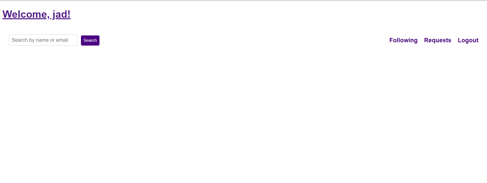
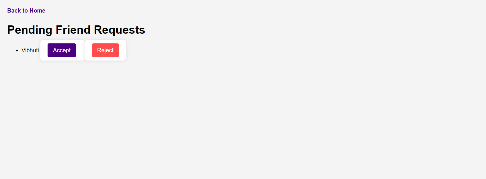
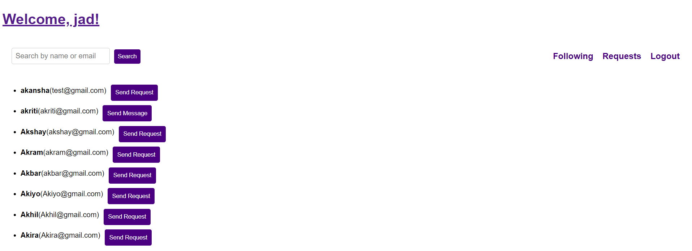

# Django based social networking application

### Website Preview
#### Home Page



#### Incoming Request Page


#### Search Results Page 


----

### Clone

- Clone this repo to your local machine.

### Create or Run a Virtual Environment

```shell
$ python -m venv env
$ .\env\scripts\activate
```

#### Note

- Before running the project make sure you are in project directory where manage.py file present if not then enter
  >cd social_network

## Installation 📦

>pip install -r requirements.txt


### Run server locally

```shell
$ python manage.py makemigrations
$ python manage.py migrate
$ python manage.py runserver
```
> [Go to localhost:8000](http://127.0.0.1:8000/)

---
## Running app in Docker

- Install docker-compose

- Execute the following commands from the root of the project

  - Build our images
  >docker-compose build

  - Starting our containers and services
  >docker-compose up
  
- Visit [localhost:8080](http://127.0.0.1:8000/) in your browser to run the app

## Features 📋


### User Authentication
- **Login:**
  - Users can log in with their email.
  - Email is case insensitive.
- **Signup:**
  - Users can sign up using their email only.
  - No OTP verification is required; only a valid email format is sufficient.

### User Search
- **Search Users:**
  - Users can search for other users by name.
  - **Substring Name Match:** If the search keyword is a substring of a name, all users with names containing the substring are returned.
  - Results are paginated, showing up to 10 records per page.


### Friend Request Management
- **Send Friend Request:**
  - Users can send a friend request to other users.
- **Accept Friend Request:**
  - Users can accept pending friend requests.
- **Reject Friend Request:**
  - Users can reject pending friend requests.
- **List Friends:**
  - Users can view a list of all friends (users who have accepted the friend request).
- **List Pending Requests:**
  - Users can view a list of all pending friend requests they have received.
- **Rate Limiting:**
  - Users are limited to sending a maximum of 3 friend requests per minute.
---

